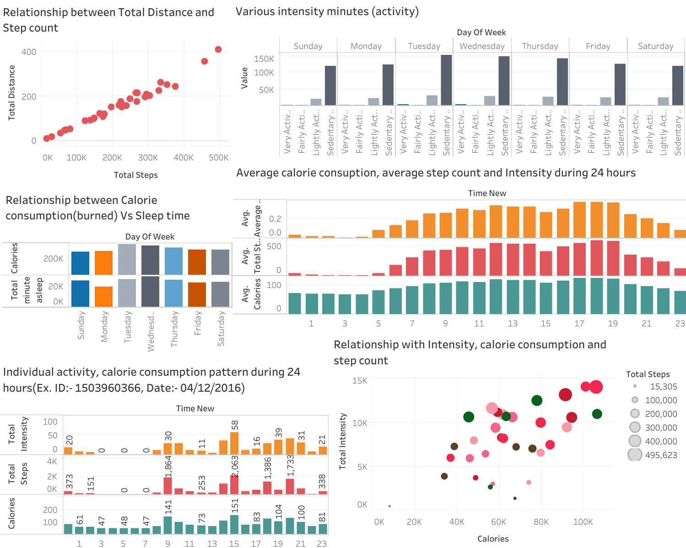

# Google data analytics : capstone project
### Jenson Samuel
### 2023-09-05

## Bellabeat smart device fitness data analysis {.tabset .tabset-fade .tabset-pills}
### 1. INTRODUCTION 
This is a part of google data analysis capstone project, in which, Bellabeat smart device fitness data is used. This data is colected originally from 33 fitbit users. As we progressing further, goes through phases of ask, prepare, prepare, process, analysis and act to succesfully answer the business questions for compleating the case study.

#### i. Scenario
BellaBeat is a successful small company, but they have potential to grow bigger in global smart
device market. Urška Sršen, co founder and Cheif Creative Officer of Bellabeat, believes that
analyzing smart device fitness data could help unlock new growth oppertunites for the company. Based
on this requirement, the data analyzis job is undertaken to find insights, those guide the future
marketing strategy for the company. The entire analysis is meant to present before Bellabeat
executive team with all the recommendation to help the its marketing startegy.

#### ii. About company
Urška Sršen and Sando Mur founded Bellabeat, a high-tech company that manufactures health-focused
smart products. Collecting data on activity, sleep, stress, and reproductive health has allowed
Bellabeat to empower women with knowledge about their own health and habits.Since it was founded in
2013, Bellabeat has grown rapidly and quickly positioned itself as a tech-driven wellness company
for women.

### 2. ASK
Here junior analyst asked to analyze smart device usage data to gain insight into how
consumers use Bellabeat smart devices. For selecting one Bellabeat product to apply these
insights to in the presentation.

#### i. Business tasks

a. What are some trends in smart device usage?

b. How could these trends apply to Bellabeat customers?

c.  How could these trends help influence Bellabeat marketing strategy?

#### ii. Stakeholders

a.  Urška Sršen: Bellabeat's co founder and Chief Creative Officer

b.  Sando Mur: Mathematician and Bellabeat's co founder; key member of the Bellabeat executive team

c.  Bellabeat marketing analytics team: A team of data analysts responsible for collecting,
    analyzing, and reporting data that helps guide Bellabeat's marketing strategy. Junior data analyst joined this
    team six months ago and have been busy learning about Bellabeat''s mission and business goals
    as well as how a junior data analyst, can help Bellabeat achieve them.

### 3. PREPARE

#### i. Data source
open data is available for this case study analysis, data contains in  18 CSV files which are available both Long and wide formats. FitBit fitness tracker data from:- <https://www.kaggle.com/datasets/arashnic/fitbit>
#### ii. Reliability
Data is reliable because it generated by a survey of reliable third party Amazon Mechanical Turk.
#### iii. Originality
Data is originated from 30 original fitbit users those are consented to provide data.
#### iv. Comprehensiveness
Data provide different types of information like daily, hourly and minute activity, moving distance, step count, sleeping duration, calories burned etc.
#### v. Credibility
Data is critically examined and thoroughly checked.Data is comes from open source, and no personal information used.
#### vi. Data drawback
Available data is 7 years old (2016), So the fitness activity pattern of users may changed over time.

### 4.PROCESS

Microsoft SQL Server Management Studio is used to process the data and following data sets are mainly used to analyze the data.
#### i. Datasets selected
```{r (Importing data sets for analysis), echo=FALSE}
dailyActivity_merged.csv
sleepDay_merged.csv
hourlyCalories_merged.csv
hourlyIntensities_merged.csv
hourlySteps_merged.csv
```
#### ii. Data cleaning
Checked all the chosen data tables and found three dulicate instances in sleep data file, removed duplicated entries. Converted date in mm/dd/yy format and added a new column for weekday analysis as "weekday" and updated day of week. Hourly intensities, Hourly calories and Hourly steps are joined together for further analysis.

#### iii. Findings from initial observations
-   Summary of daily physical activities of 940 observations over a month of 33 distinct people provided
-   Sleep data of 24 people which consists of 413 observations of Total minutes asleep and total minutes in bed are provided.
-   Heart rate data for 14 people available
-   A METs data for 8 people available
-   3 duplicate entries found with the Sleep data are removed for further analysis.
-   Due to small sample size of heart rate and METs data, it won't be able to provide meaningful insight. So those are dropped to take this analysis process.
### 5. ANALYSIS
#### i. Finding the reliabilty by checking data pattern
```{r 1 warning=FALSE, echo=FALSE}
SELECT DISTINCT Id, ActivityDate,
TotalDistance AS TotalDistance,
TotalSteps AS TotalSteps FROM dailyActivity_merged;
```


##### Obsevations
- A positive relationship between distance travelled and step count from data seems the available data is reliable
#### ii. Finding the relationship between Total distance and step count
```{r 2 echo=FALSE}
SELECT day_of_week AS Week_day,
AVG(Total_minute_asleep) AS AVG_minuteasleep,
AVG(Calories) AS AVG_Calorie_Consumption FROM dailyActivity_merged
GROUP BY day_of_week;
```


##### Obsevations
- Sleep data of 24 people is available from total 33 participants. 
- However some disproportionate relation in weekend days, Total minutes asleep and calorie consumption has a direct relationship.
- In weekend days shows dispropotionate trend towards the general trend, that is, more sleep duration compared to calorie consumption displays.

#### iii. Intensity level activity on weekdays
```{r 3 echo=FALSE}
SELECT day_of_week AS Week_day,
SUM(VeryActiveMinutes) AS TotalVeryActiveMinutes,
SUM(FairlyActiveMinutes) AS TotalFairlyActiveMinutes,
SUM(LightlyActiveMinutes) AS TotalLightlyActiveMinutes,
SUM(SedentaryMinutes) AS TotalSedentaryMinutes FROM dailyActivity_merged
GROUP BY day_of_week;
```


##### Obsevations
- How time is consumed generally, weather as very active, moderately active or lightly active or idle
- Weekday pattern describes the life style habits over 30 days, which show most active week days and less active weekdays
- Induvidual data analysis of these type, reveals the daily life habits of workout pattern and these data useful helps them to plan their daily workout routine.

#### iv. Finding user's activiy, calorie consumption and step count 
```{r 4 echo=FALSE}
SELECT Id AS Id,
SUM(TotalIntensity) AS Total_Intensity,
SUM(Calories) AS Total_Calories,
SUM(TotalSteps) AS Total_Steps FROM hourlyActivity
GROUP BY Id;
```


##### Obsevations
- Step count, calorie consumption and intensity of activity are directly proportionate
- As these factors has strong direct relationship, also exhibits intensity and step count level of 33 users.
#### v. Daily user activity pattern 
```{r 5 echo=FALSE}
SELECT Time_New, 
AVG(TotalIntensity) AS AVG_Intensity,
AVG(Calories) AS AVG_Calories,
AVG(TotalSteps) AS AVG_Steps FROM hourlyActivity
GROUP BY Time_New ORDER BY Time_New;

SELECT Time_New, 
AVG(TotalIntensity) AS AVG_Intensity,
AVG(Calories) AS AVG_Calories,
AVG(TotalSteps) AS AVG_Steps FROM hourlyActivity
WHERE Id = '1503960366' AND Date_New = '2016-04-12'
GROUP BY Time_New ORDER BY Time_New;
```


##### Observations
- Most desired workout time revealed as from 7 AM to 9 PM
- Daily activity pattern reveals the workout sequence, timing, idle time and sleep duration
- Individual hourly activity pattern shows most step count and intensive hours are from 8AM to 9PM. Sleep time can be identified as from 3AM to 7AM.

### 6. SHARE
#### i. <a href="https://public.tableau.com/app/profile/jenson.samuel/viz/js_googledataanalysiscapstoneproject/Dashboard1#1">Sharing tableau dashboard</a>


#### ii. Conclusions
a. A positive relationship between distance travelled and step count from data seems the available data is reliable. Among 33 individual sample data, only 24 samples have sleep time data. This shows the remaining user’s tendency of avoidance of usage of device during sleeping time. So the sleep time data is limited to 24 samples.

b. Activity minutes and calorie consumption shows a positive relationship. Here, we can see that, as the intensity of activity increases the quality of sleep (sleep duration) also increases. However, the weekend days shows a negative relation between sleep duration and physical activity minutes.

c. The intensity of activities, calorie consumption and step count shows a very positive relationship. Analyzing the hourly pattern of this factors in a day provide some meaningful insight.  It describes that, most physically active time is from 7AM to 9 PM and remaining are the less active, sedentary or sleeping time. This is the general pattern of physical activity for 24 samples provided.

d. Hourly analysis helps to find summary of hours of different intensity activities for each person. Individual consumption of calorie, step count and sleep time are measurable and it is useful to disclose the weekday statistics of these activities. Helps to find individual lifestyle and useful to provide tips and notifications to improve the lifestyle.

e. Individual data for each hour of hourly activity, calorie consumption, step count, and sleep hours can be clearly analyzed. This helps to provide a clear understanding on daily activities and sleep hours, peak hours of each activity and low intensity hours. It is good to provide reminder of sleep hours of each day that improve the healthy lifestyle.

### 7. ACT
#### {-}
#### i. Recommendations
a. Encouraging to wear the device in sleeping time, for measuring the sleep time helps to plan a balanced fitness routine. It is useful to notify users about their sleep duration. Keeping optimal fitness activity and good quality of sleep can improve the health to lead an active life.

b. Metabolic equivalent (METs) is measure of expenditure of body energy and this using to find the exercise tolerance for individuals. Live data of heart rate identify signs of abnormal heart rhythms. Promoting to engage the users in these factors using the device is very useful for providing some precious services to plan and follow a safe fitness routine and good to keep cardiovascular health.

c. Provide app notifications of activity patterns, step count, sleeping time for each individual to get an insight on their lifestyle and tips and recommendations to improve remind users to take daily exercise.

d. Free medical checkups or free subscription for newly introduced services can be used as promotional offers to the users based on the measurement of their engagement in the device usage.
